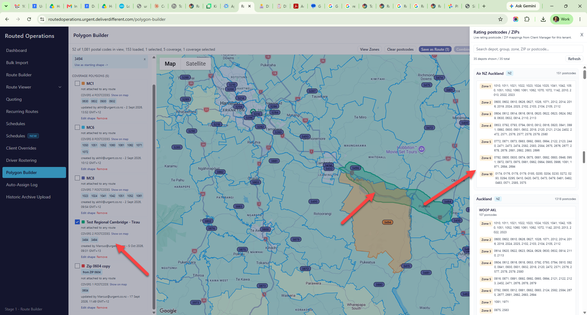
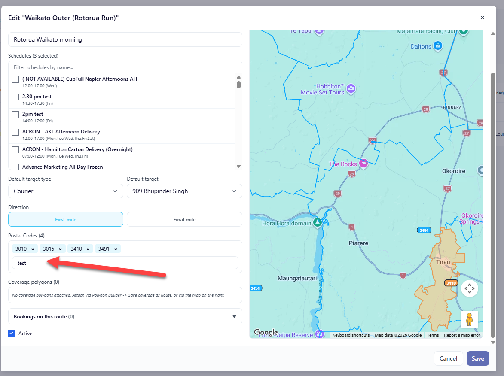

# Custom polygons: searchable in recurring routes, and members of zone groups

_Steve Bonnici -> Kevin, 2026-10-07. Companion to
`KEVIN-SCHEDULE-ORIGIN-CLIENT-ADDRESS-2026-10-07.md` (same branch family) and the collapse plan.
Code references are to routed-operations `develop` as at 2026-09-29 and the dbmigrationsv2
migrations through 2026-09-28._

---

## 0. TL;DR

| | |
| :- | :- |
| **Two uses, two plumbings** | (1) **Dispatch**: a custom polygon attached to a recurring route tells the auto-assign resolver which route a job belongs to. This exists, but the only way to attach one is from Polygon Builder or the route map. (2) **Bookability**: a custom polygon should be a **member of a zone number inside a zone group**, exactly like a postcode, because zone groups are what decide whether a client can book to an address. This does not exist. |
| **What is wrong today** | Polygons can be attached to a **schedule** (`tblSchedulePolygon`, Coverage tab). **No stored procedure reads that table.** Schedule-attached polygons have no effect on booking. The attachment was wired to the wrong object. |
| **Part 1 (small)** | The recurring-route modal's **Postal Codes** box becomes one lookup: type a postcode *or* a polygon name; a polygon comes back as a differently coloured chip and is written to `tblBulkRunPolygonRoute`. No resolver change: it already prefers route polygons. |
| **Part 2 (the real work)** | New `BulkZonePolygon` (zone group, zone number, polygon). Polygon Builder's zone drawer gains "Add to zone". The legacy zone-resolution functions are **extracted into source control first**, then given a polygon branch: when the address has coordinates, point-in-polygon wins; postcode is the fallback. `tblSchedulePolygon` and the schedule Coverage tab's polygon list are retired. |
| **Decisions needed** | Section 7. |

---

## 1. What exists today

### 1.1 Polygons

- `tblBulkRunPolygon` (`PolygonId`, `Name`, `ColorHex`, `GeographyData`, `CentroidLatitude/Longitude`,
  `SourceType`, `SourceCode`, `PartiallyIncludedZips`, `Active`, audit) + `tblBulkRunPolygonPoint`.
  Built and edited in **Polygon Builder**. `PartiallyIncludedZips` is auto-derived on every
  create/update (`BulkPolygonService`) and lists the postcodes the shape overlaps.
- `tblBulkRunPolygonRoute` (`RouteId`, `PolygonId`) - route coverage. **Read by the resolver**:
  `UTL_stpRouteAutoAssign_ResolveOneSide` runs custom-polygon point-in-polygon **first** (narrowed
  by `PartiallyIncludedZips`), then falls back to `RouteZipcodes` (2026-08-04 Rule 2A).
- `tblSchedulePolygon` (`ScheduleName`, `PolygonId`) - created 2026-08-25 with the schedule
  junctions, written by the Schedules NEW **Coverage** tab. **Not referenced by any SP, function,
  trigger or view** (A2 dependency scan, Urgent Prod, 6 Oct). Dead data.



### 1.2 Zones

- `BulkZonePostcodeGroup` (`Id`, `Name`, `ClientId` nullable, `DepotId`) - a **zone group**, owned by
  a depot, optionally client-specific.
- `BulkZonePostcode` (`PostCode`, `Zone`, `PostcodeGroupId`, `DepotId`, `FromSiteId`, ...) - one row
  per postcode, saying which **zone number** that postcode is in, within that group. This is the
  "Rating postcodes / ZIPs" drawer in Polygon Builder: depot -> zone group -> zone -> postcodes.
- A schedule points at a delivery zone group (`PostcodeGroupId`) and a pickup zone group
  (`PickupPostcodeGroupId`); `BulkZoneSchedule` (`Zone`, `ScheduleId`) and `BulkPickupZoneSchedule`
  say which zone numbers that schedule fulfils on each side ("Zones this leg fulfils" on the
  Delivery card).
- **Resolution at booking time is postcode-only.** The availability functions
  (`UTL_/DD_fncJob_GetClientAvailableBulkRunSchedule`), the zone lookup (`UCL_fncT_GetBulkZone`,
  `UTL_fncBulkZonePostcode_IsActive`) and rating (`fncT_BulkZoneRate_WithLinehaul`) map From/To
  **postcodes** to zones. None of them looks at geometry. **None of the zone/rating functions is
  in dbmigrationsv2**; they exist only in the tenant databases.

### 1.3 Recurring route modal

Postal Codes is a typeahead over postcodes (`RouteZipcodes` / `ZipPolygon`). Coverage polygons is
a read-only list: "No coverage polygons attached. Attach via Polygon Builder -> Save coverage as
Route, or via the map on the right." Two inputs for one idea.



---

## 2. Part 1 - one coverage lookup in the recurring route modal

**Rule:** the Postal Codes box finds **postcodes and polygons**. Rename the section **Coverage**.

- Typeahead query: postcode prefix match as today, **plus** `tblBulkRunPolygon.Name` contains match
  (active only). Results grouped: "Postcodes" then "Polygons".
- A chosen polygon renders as a chip in the polygon's `ColorHex` with a small shape icon, so it is
  visibly not a postcode. Removing the chip removes the binding.
- Save writes polygons to `tblBulkRunPolygonRoute` (existing `bulkPolygonIds` on
  `UpsertRouteRequest`, already replace-wholesale) and postcodes to `RouteZipcodes` as today.
- The map highlights polygon chips the same way it highlights postcode chips.
- The separate "Coverage polygons" list goes; the chips are the list. Polygon Builder's "Save
  coverage as Route" keeps working and lands in the same place.
- Backend: `GET /api/recurring-routes/coverage/lookup?q=` returning `{ kind: 'postcode'|'polygon',
  id, label, colorHex }`. No change to the resolver, which already consumes `tblBulkRunPolygonRoute`
  first.

Acceptance: type "test" in the Waikato Outer modal, pick "Test Regional Cambridge - Tirau", save;
`tblBulkRunPolygonRoute` has the row; a booking geocoded inside that shape resolves to Route 1
(`RouteAutoAssignLog.Outcome = AssignedToRouteViaCustomPolygon`).

---

## 3. Part 2 - polygons as zone members

### 3.1 Model

A zone number inside a zone group is a set of **postcodes and polygons**.

```sql
CREATE TABLE dbo.BulkZonePolygon (
    Id              INT IDENTITY(1,1) NOT NULL CONSTRAINT PK_BulkZonePolygon PRIMARY KEY,
    PostcodeGroupId INT NOT NULL CONSTRAINT FK_BulkZonePolygon_Group
                        FOREIGN KEY REFERENCES dbo.BulkZonePostcodeGroup (Id),
    Zone            INT NOT NULL,
    PolygonId       INT NOT NULL CONSTRAINT FK_BulkZonePolygon_Polygon
                        FOREIGN KEY REFERENCES dbo.tblBulkRunPolygon (PolygonId),
    Active          BIT NOT NULL CONSTRAINT DF_BulkZonePolygon_Active DEFAULT (1),
    CreatedUtc      DATETIME2(0) NOT NULL CONSTRAINT DF_BulkZonePolygon_CreatedUtc DEFAULT SYSUTCDATETIME(),
    CreatedBy       NVARCHAR(100) NOT NULL,
    CONSTRAINT UQ_BulkZonePolygon UNIQUE (PostcodeGroupId, PolygonId)   -- one zone per polygon per group
);
```

Mirrors `BulkZonePostcode` (`PostcodeGroupId`, `Zone`, `PostCode`) with `PolygonId` in place of
`PostCode`. A polygon can sit in different zones in different groups (a group is per depot), but in
**one** zone within a group.

### 3.2 Polygon Builder UI

The right-hand drawer already shows depot -> zone group -> zones -> postcodes. Add:

- On a selected polygon's card (left list): **"Add to zone"** -> pick zone group (filtered to the
  depots in view) -> pick zone number -> saves a `BulkZonePolygon` row. The card then lists its zone
  memberships ("Zone 4 in Auckland / WOOP AKL") with remove.
- In the drawer, each zone row shows its polygons after its postcodes, with the colour swatch, so
  the group reads as one coverage set.
- "Save coverage as Route" is unchanged (Part 1's table).

### 3.3 Booking-time resolution

Step 0, before anything else: **extract the legacy functions into dbmigrationsv2** as source-control
snapshots, the way `uspPrebookSet` was (migration `20260922120000`): `UCL_fncT_GetBulkZone`,
`UTL_fncBulkZonePostcode_IsActive`, `fncT_BulkZoneRate_WithLinehaul`,
`fncT_StpBulkZoneRate_GetAmountByJobID`, `UTL_/DD_fncJob_GetClientAvailableBulkRunSchedule`
(the last two are already in source). Nothing below is safe until there is a diff to review.

Then, wherever a function maps an address to a zone within a group:

```
IF the address has coordinates (lat/long):
    zone := the Zone of the first active BulkZonePolygon in this group whose polygon
            STIntersects(point), narrowed first by PartiallyIncludedZips containing the postcode
    IF found -> use it
resolve by postcode as today (BulkZonePostcode)
```

- **Polygon first, postcode fallback.** A polygon is drawn precisely to override the postcode.
- `PartiallyIncludedZips` is the pre-filter so `STIntersects` runs against a handful of shapes, the
  same trick the route resolver uses.
- If a point falls in **two** polygons of the same group with different zones, take the **lowest**
  zone number and log it; Polygon Builder warns when a polygon being added overlaps another already
  in the group.
- Where coordinates are absent (some API bookings), behaviour is identical to today.

### 3.4 Retire the schedule attachment

- Stop writing `tblSchedulePolygon` from the Coverage tab. The tab's polygon section becomes
  read-only: "Polygons in this schedule's zone groups", derived from `BulkZonePolygon` for the
  schedule's `PostcodeGroupId` / `PickupPostcodeGroupId` and the zones it fulfils.
- Migration: for each existing `tblSchedulePolygon` row, report (schedule, its delivery zone group,
  polygon) so ops can place the polygon in a zone deliberately. **Do not auto-assign a zone number**;
  there is no way to infer it. Then drop the table.

---

## 4. Where coordinates come from

Postcode resolution works from text. Polygon resolution needs a point.

| Entry | Coordinates available? |
| :- | :- |
| Web booking | Yes - address is geocoded on entry. |
| Bulk Import | Yes when rows carry From/To lat/long or the client site is geocoded (origin spec 4.4-4.5); otherwise AddressService geocodes. |
| API (`WS_stpJob_Insert` callers) | Sometimes. Where absent -> postcode fallback, no behaviour change. |
| Availability preview on the booking page | Only after the address is entered; the schedule list refreshes once coordinates exist. |

---

## 5. Acceptance

1. In Polygon Builder, add "Test Regional Cambridge - Tirau" to Zone 4 of the Auckland zone group;
   the drawer shows it under Zone 4; `BulkZonePolygon` has the row.
2. A web booking to an address inside that shape, on a schedule whose delivery zone group is that
   group and which fulfils Zone 4, is **offered and rated as Zone 4** even if the address's postcode
   is not in Zone 4's postcode list.
3. The same booking with coordinates stripped resolves by postcode as it does today.
4. A schedule with polygons in `tblSchedulePolygon` shows them read-only on the Coverage tab with
   "not yet placed in a zone" until ops adds them to a zone.
5. Part 1: typing a polygon name in the route modal's Coverage box offers it; saving binds it; the
   resolver assigns a job inside it to that route.

---

## 6. Order of work

1. Part 1 (route modal lookup) - UI + one lookup endpoint, independent, can ship first.
2. Extract the zone/rating functions into dbmigrationsv2 (snapshots, no behaviour change).
3. `BulkZonePolygon` + Polygon Builder "Add to zone".
4. Polygon branch in the extracted functions, behind a tenant setting until acceptance 2 passes
   on staging for both NZ and US.
5. Retire `tblSchedulePolygon` (report, then drop).

---

## 7. Decisions needed from Steve

1. **Overlap rule**: lowest zone wins (section 3.3), or refuse to add an overlapping polygon to a
   group?
2. **Client-specific zone groups** (`BulkZonePostcodeGroup.ClientId`): can a polygon be added to a
   client's group as well as the depot default? (Recommend yes; same table, no extra rule.)
3. **Pickup side**: polygons resolve the collection zone (`PickupPostcodeGroupId`) the same way as
   delivery? (Recommend yes; the Collection card is gaining the zone group now - origin spec 3.2.)
