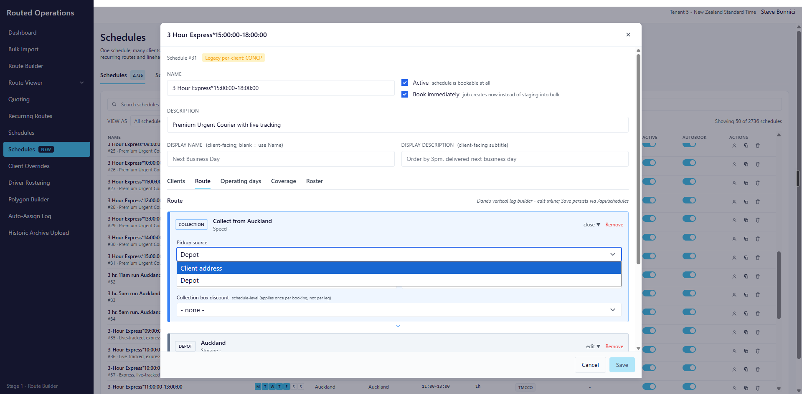
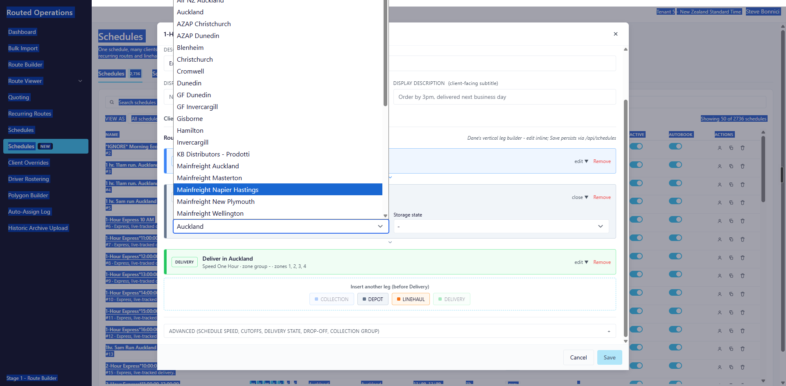

# Schedule origin: the first Depot leg can be "Client address"

_Steve Bonnici -> Kevin, 2026-10-07 (revised same day to Marcus's shape; revised again after Kevin's
review of 7 Oct 12:21 - see section 9 for what changed). Closes the "From client
address" confusion discussed with Kerran on 6 Oct. Supersedes F10's pickup-source wording and F12 in
`KEVIN-SCHEDULES-NEW-FIXES-2026-09-20.md`. Companion to
`KEVIN-SCHEDULE-COLLAPSE-COMPAT-VIEW-2026-09-29.md` (one new column on the detail table)._

Code references are to routed-operations `develop` on GitLab as at 2026-09-29 and the
dbmigrationsv2 SP re-emits of 2026-09-25 / 2026-09-28.

---

## 0. TL;DR

| | |
| :- | :- |
| **Problem** | "Pick up from client address" lives inside the Collection leg. Choosing it nulls `PickupDepotId` but the schedule still books a pickup job (LHP) from the client to the depot, then a delivery from the depot. That is the opposite of what the setting is for. |
| **Intent** | Some clients (warehouses, distribution centres) want runs built **from their own site**. The client address *is* the origin. There is no collection job and no consolidation at our depot. One delivery job per consignment, runs fan out from the client. |
| **Decision (Steve, Marcus)** | The chain's **first Depot leg** gains a dropdown value **"Client address"**. A schedule that delivers straight from a client's warehouse is **Depot (Client address) -> Delivery**, optionally with Linehaul legs in between. There is **no Collection leg**. Client-origin schedules are client-specific, never default. **No real depot rows per client** (avoid region sprawl). |
| **Booking SPs** | The **bulk** path (`WS_/DD_stpBulkScheduleJob_Insert`) already produces the right job: one job from the booking's own From address. The **web/API single-job path** does not: `WS_stpJob_Insert`, `WS_stpJob_Topup_Insert` and `DD_stpJob_InsertExcelerator` overwrite the pickup address and coordinates with the depot's for a no-collection schedule. Three-line fix in each, reading a **stored** `OriginType` (section 4.3). |
| **Real blockers (two)** | (1) Route Builder's region filter finds jobs by matching **pickup lat/long or From address to `tblBulkRegion`**; a client-address pickup matches no depot, so the job never appears when filtering by region. The filter must also admit `tblBulkJob.RegionID` for these schedules. (2) **Bulk Import** resolves a routed job's origin from the **schedule's Region depot first** (NZ: only), so imported jobs on a client-origin schedule would be stamped with the dispatch depot's coordinates. The resolver must take the client's saved site address instead (section 4.4). |
| **Remove** | The Pickup source dropdown on the Collection leg, including the "Booking-declared" value on develop that has no backend meaning. |
| **Origin region** | `Region` comes from the **Delivery** leg and stays the delivery region. A client-origin schedule needs an **origin region** too, exactly where a collection schedule has `PickupDepotId`: new column **`OriginRegionId`**, set by a picker on the Client-address Depot card. First-leg jobs are stamped with it; delivery jobs with `Region`. The linehaul leg needs nothing extra. |
| **Storage** | `OriginType` on `tblBulkRunScheduleDetail` (collapse plan M1). Interim derivation rule in section 5 until that ships. |

---

## 1. What the code does today

### 1.1 The UI invents a Collection leg for every schedule

`ScheduleDetailModal.tsx` `seedLegsFromDto` (~line 212) **always** pushes a Collection leg,
with `pickupSource = pickupDepotId ? 'depot' : 'client_address'`. Whether the schedule actually
books a pickup (`BookPickup`) is not consulted. So the "3 Hour Express 15:00-18:00" on-demand
schedule in the screenshot shows "Collect from Auckland" even though it is a delivery-only
schedule. This is F6 from the September list, seen from the other side.



On develop the dropdown has **three** values (`ChainBuilder.tsx` ~line 546): Client address,
Depot, Booking-declared. The deployed build shows two. All the dropdown does on save
(`NewScheduleModal.tsx:220`, `ScheduleDetailModal.tsx:136`) is:

```ts
pickupDepotId = leg.pickupSource === 'depot' ? leg.pickupDepotId : null;
```

"Client address" and "Booking-declared" are indistinguishable to the backend. `BookPickup` is a
separate checkbox under Advanced (`ScheduleDetailModal.tsx:1757`), unrelated to the leg.

### 1.2 What actually creates a pickup job

`WS_stpBulkScheduleJob_Insert` (and the `DD_` twin):

```sql
@HasPickupSchedule = ISNULL(s1.BookPickup, 0)                      -- line ~255
@InsertParentJob   = CASE WHEN @HasPickupSchedule = 1 OR @HasLinehaulSchedule = 1 THEN 1 ELSE 0 END
```

- `BookPickup = 1` -> parent + **LHP** (client -> depot) + DEL (depot -> consignee). The parent
  and DEL `From*` columns are overwritten with the depot; the client's address is kept in
  `BookFrom*` for the LHP (`InsertChildJobs` ~line 524-640 reads `s.PickupDepotId` for the LHP
  destination via `tblbulkRegion`).
- `BookPickup = 0` and no active linehaul rows -> `@InsertParentJob = 0` -> **one job**, `From*`
  = the booking's own From address (the client), `To*` = the consignee, `RegionID = s1.Region`.

So **Client origin = `BookPickup = 0`, `PickupDepotId = NULL`, no Collection leg.** The SP
already does the right thing for that combination. Nothing in the booking path needs to
change for a delivery-only client-origin schedule.

Linehaul legs that load at the client site are also already supported:
`tblBulkScheduleLinehaul.FromClientAddress = 1` (column confirmed against production 7 Oct; the SP's
local variable is `@LinehaulBookFromClientAddress`) makes `InsertChildJobs` (~line 710) address the
LH leg from the booking's `From*` instead of `tblBulkRegion`. That is the HelloFresh case. **The flag has
never been used:** 0 of 9,547 linehaul rows across both production tenants have it set. (Plenty of
cross-region schedules exist; they all collect into a depot first and linehaul depot -> depot.)

**But the web/API single-job path is different.** `WS_stpJob_Insert:243` derives

```sql
@IsCollectFromClientAddress = CASE WHEN ISNULL(BookPickup,0) = 1 AND PickupDepotId IS NULL THEN 1 ELSE 0 END
```

so a client-origin schedule (`BookPickup = 0`) gets 0, and `:247` then overwrites `FromAddress`, suburb,
postcode, country **and `PickUpLatitude/PickUpLongitude`** from `tblBulkRegion` joined on `s.Region`.
It fires when `@DONOTOverwriteSceduleFromAddress = 0` OR `@JobTypeID IN (94,95,110)`, so the three
home-delivery speeds (AH, SH, BEH) overwrite even when Book-immediately is on. Worked example on
`PB TECH TEST (AIRPORT)` (#13342, Region Auckland, already `BookPickup = 0` / null depot): book on
speed SH through the web and the job's From becomes the Auckland depot with the depot's coordinates.
Because the coordinates then match a depot, the job *does* appear in the Route Builder region filter -
blocker 1 looks fixed while the run starts in the wrong place. Same shape in `WS_stpJob_Topup_Insert`
and `DD_stpJob_InsertExcelerator` (US has no 94/95/110 clause; Book-immediately only).

### 1.3 Why Route Builder cannot see these jobs

`RunService.cs` ~line 64-104 (and the matching "R2.1" block in `JobService`): when the operator
filters by region, the job set is **not** `tblBulkJob.RegionID IN (...)`. It is a raw SQL join:

```sql
LEFT JOIN tblBulkRegion breg
  ON ((breg.PickupLatitude = j.PickUpLatitude AND breg.PickupLongitude = j.PickUpLongitude)
   OR LOWER(RTRIM(breg.FromAddress)) = <normalised j.FromAddress>)
WHERE breg.BulkRegionId IN (...)
```

A job whose pickup is a client address matches no `tblBulkRegion` row, so it is excluded from
every region-filtered Route Builder view. This mirrors a legacy SP and was correct when every
bulk job started at a depot. It is the actual reason client-origin schedules "don't work".

Run start is **not** depot-bound: `RunDtos.cs:105` / `RunService.cs:517` - the operator marks one
job in the run as `IsStart`, and `routeService.ts` sends that stop as the HERE `start`. So once
the jobs are visible, building a run that fans out from the client site needs no new concept.

---

## 2. The model

### 2.1 Origin is expressed by the first Depot leg

The chain already begins with a Depot leg that says where the goods are at the start. That leg's
dropdown gains one value, **Client address**, alongside the real depots.



| First Depot leg | Chain | Booking result | Run |
| :- | :- | :- | :- |
| **A real depot** (today's model) | optional **Collection** (collect from client into the depot, zone-driven per F10) -> **Depot** -> 0..n **Linehaul** -> **Delivery** | `BookPickup` as set; LHP if a Collection leg exists; DEL from depot | Starts at the depot (or wherever the operator marks `IsStart`) |
| **Client address** (new) | **Depot (Client address, origin region R1)** -> 0..n **Linehaul** (`FromClientAddress = 1`, optionally landing at a real Depot) -> **Delivery (region R2)**. **No Collection leg.** | `BookPickup = 0`, `PickupDepotId = NULL`, `OriginRegionId = R1`, `Region = R2`; one DEL job from the client's From address (or LH legs from the client, then DEL) | First-leg jobs under R1, delivery jobs under R2 - the same split a collection schedule has between `PickupDepotId` and `Region`; start = client site, from the booking's own pickup coordinates |

Examples: *Afternoon home from the Auckland depot* = Depot (Auckland) -> Delivery.
*PB Tech warehouse* = Depot (Client address) -> Delivery. *HelloFresh* = Depot (Client address)
-> Linehaul -> Depot (Auckland) -> Delivery.

Rules:

- Client-origin schedules are **client-specific**. A default schedule cannot have a Client-address
  first depot (validation: requires at least one client link and `IsDefault = 0`).
- A **Collection leg cannot coexist** with a Client-address first depot. Collection means
  "collect from the client into the depot"; when the depot *is* the client there is nothing to
  collect. ChainBuilder disables "Add Collection" and removes an existing one on confirm.
- **Two regions, as today.** `Region` is derived from the **Delivery** leg (`ScheduleDetailModal`
  derive: `regionId = leg.regionId` on the delivery leg) and is unchanged by this spec. The
  **origin region** is new: on a real first depot it is that depot; on Client address the Depot
  card shows an **Origin region** picker (same `tblBulkRegion` list) and the value is written to
  **`OriginRegionId`**. It is the counterpart of `PickupDepotId` on a collection schedule: which
  branch owns the start of the chain. PB Tech: origin Auckland, delivery Auckland. HelloFresh shape:
  origin Auckland, delivery Wellington.
- **The linehaul leg needs no region of its own.** Its from side is the client (`FromClientAddress
  = 1`), its to side is a real depot; the origin region lives on the schedule.
- The Collection leg means exactly one thing from now on: **collect from the client's address
  into the depot**. Its "Pickup source" dropdown is deleted. Its zones (F10) decide coverage.

### 2.1b What the regions are for - and what they are not

Neither `Region` (delivery) nor `OriginRegionId` (origin) is a place on a client-origin schedule.
They are the **owning branches**, needed for:

- **Zones and pricing.** Zone groups belong to a region (`tblBulkRegion` -> `BulkZonePostcodeGroup`).
  The schedule's delivery zone group is one of its region's groups, and the rating function
  (`fncT_BulkZoneRate_WithLinehaul`, called with `@DepotId`) prices against it.
- **Who sees the work.** Route Builder, Route Viewer and the run list are scoped by region, and
  runs carry a region id. The Auckland team sees Auckland work.
- **Linehaul endpoints**, where the chain has linehaul legs.

Its **coordinates are never read for a client-origin job.** The three places that read a
region's `PickupLatitude/Longitude` today are: the LHP destination / linehaul origin (no
collection leg exists, and linehaul legs use `BookFromClientAddress`), Bulk Import's first
origin step (replaced by the client site, section 4.4), and Route Builder's region filter
(replaced by `RegionID`, section 4.1). After those two changes the job carries the client's
coordinates and the region supplies zones, pricing and ownership. There is no geolocation
conflict to resolve.

Dropping `Region` for client-origin schedules was considered and rejected: the zone group would
have no home and the job would be invisible to every region-scoped screen.

### 2.1a Why not a real depot row per client warehouse

The dropdown already contains partner premises modelled as depots (GF Dunedin, KB Distributors,
Mainfreight sites). A PB Tech warehouse *could* be set up the same way with no code change, and
Route Builder's coordinate match would even work because `tblBulkRegion` stores
`PickupLatitude` / `PickupLongitude`. **Decided against (Steve, 7 Oct):** every client warehouse
would become a depot in every filter and dropdown, and someone has to maintain the row. The
booking already carries the client's pickup coordinates; the run starts from those. "Client
address" in the Depot leg is the right abstraction.

### 2.2 What is removed

- `pickupSource` on `CollectionLeg` (`ChainBuilder.tsx:28`) and the dropdown (~line 540-549).
- The `'booking'` / "Booking-declared" value - **already removed by Kevin on 5 Oct (`269c4dc`, on
  `origin/develop`)**. The dropdown itself still goes with this work.
- **The Collection card's pickup depot picker as well** (confirmed Steve 7 Oct). The collection's
  destination is the chain's Depot leg; `PickupDepotId` is derived from it on save. Safe because
  `seedLegsFromDto` already seeds the Depot leg as `depotId: d.pickupDepotId`
  (`ScheduleDetailModal.tsx:221`), so the two cards show the same value today. Regression case:
  `(TEST) AKL > CHCH Pre 10am Medical` - Collection depot Auckland (`PickupDepotId = 8`), Depot leg
  Auckland, `Region = 20` (Christchurch); derived on save `PickupDepotId = 8`, unchanged.
- The "Pickup source" summary line on the collapsed Collection card (`ChainBuilder.tsx:460`).
- `seedLegsFromDto` unconditionally adding a Collection leg (section 1.1).

### 2.3 Not changed

- The linehaul row's `fromClientAddress` checkbox ("Book from client address (overrides From
  depot)", `ChainBuilder.tsx:797`), DB column `tblBulkScheduleLinehaul.FromClientAddress`. It is a
  per-leg concern and the SP honours it. On a
  Client-origin schedule it defaults to **on** for the first LH leg.
- `BookPickup` as the DB truth for "has a collection job". The UI stops exposing it as a loose
  checkbox; it is derived: `BookPickup = (OriginType = 'depot' AND chain has a Collection leg)`.

---

## 3. UI

### 3.1 Depot card (first Depot leg), both `NewScheduleModal` and `ScheduleDetailModal`

The existing depot dropdown gains **"Client address"** as its first entry (above the real
depots). When selected:

```
DEPOT   Client address                         edit v  Remove
        Goods are at the client's own address at the start of this schedule.
        Origin region  [ Auckland            v ]        Storage state  [ - v ]
```

- **Origin region** picker appears (same `tblBulkRegion` list). Required. Writes
  **`OriginRegionId`** - never `Region`, which stays the Delivery leg's region.
- Card title reads "From client address" instead of "{Depot name}".
- If a Collection leg exists: confirm "Client-origin schedules have no collection job. Remove the
  Collection leg?" Yes removes it; No reverts the dropdown.
- Switching back to a real depot: Collection leg is **not** auto-added; the operator adds it if the
  schedule really collects. Origin region picker hides; `OriginRegionId` = the chosen depot.
- Only the **first** Depot leg offers "Client address". A later Depot leg (after a Linehaul) is a
  real depot.

### 3.2 Chain builder

- Collection card: title "Collect from client address -> {depot from the chain's Depot leg}".
  Fields: speed (rating), zones (F10), collection box discount. **No source dropdown, no depot
  picker.**
- "Add Collection" button disabled with tooltip when the first Depot leg is "Client address".
- Linehaul card on a Client-origin schedule: `fromClientAddress` defaults true on the first LH
  leg; From-depot select disabled while it is on (already the behaviour at `ChainBuilder.tsx:686`).

### 3.3 Schedules NEW list

The existing Origin / depot column shows "Client address" (with the origin region in the
tooltip) for these schedules. Filterable. Useful for ops to find
the client-origin set when building runs.

### 3.4 Advanced

Remove the `BookPickup` checkbox from Advanced (`ScheduleDetailModal.tsx:1757`,
`NewScheduleModal.tsx:654`). Derived per section 2.3.

---

## 4. Route Builder

### 4.1 Region filter (the blocker)

`RunService` ~line 64 and the `JobService` R2.1 block: extend the raw SQL so a job qualifies if
**either** its pickup matches a depot (today's rule) **or** it belongs to a Client-origin
schedule whose **origin region** is in the filter (the delivery jobs are already found by `Region`):

```sql
WHERE ( breg.BulkRegionId IN ({inList})
     OR EXISTS (SELECT 1
                FROM dbo.tblBulkRunSchedule s                 -- compat view after collapse M2
                JOIN dbo.tblBulkRunScheduleHeader h ON h.ScheduleId = s.ScheduleId
                WHERE s.BulkRunScheduleId = j.ScheduleId
                  AND h.OriginType = 'client'
                  AND h.OriginRegionId IN ({inList})) )
  AND ISNULL(j.Done, 0) = 0
  {dateClause}
```

Until `OriginType` is stored, the **read side may use the interim derivation** in section 5.2 in
place of the `EXISTS` (worst case: an extra job becomes visible in a filter). **Route Viewer already
does this**: `RVW_stpBulkRuns_2:193-206` admits a non-LHP job on `bjr.RegionID IN (@RIDS)` OR the
coordinate match, and carries a `NOT LIKE '%LHP'` guard and a `COL_LENGTH('dbo.tucJob','DepotId')`
check. Copy that shape into `RunService` / `JobService`; Route Viewer needs no change.

### 4.2 Grouping and start

- Jobs from a Client-origin schedule group into runs by `(OriginRegionId, ClientId, BookDate)` in
  the cockpit's default grouping, so one client's fan-out does not mix with depot runs.
- Default `IsStart` for such a run: the first job's **pickup** stop (which is the client site,
  from the booking's own `PickUpLatitude` / `PickUpLongitude`). Today the operator picks it;
  defaulting it is a convenience, not a requirement. No `tblBulkRegion` row is involved.
- `ReturnToStart` default on (back to the client site), operator can switch off.

### 4.3 Where a job's pickup coordinates come from

A client-origin job must carry the **client site's** coordinates, never a depot's. Two entry
paths:

| Path | Today | Client origin |
| :- | :- | :- |
| Bulk schedule booking (`WS_/DD_stpBulkScheduleJob_Insert`) | `@InsertParentJob = 0` when `BookPickup = 0` and no linehaul; every `From*` column falls through to the booking's own address. Verified by Kevin 7 Oct. | **No change.** |
| Web / API single job (`WS_stpJob_Insert:243-247`, `WS_stpJob_Topup_Insert`, `DD_stpJob_InsertExcelerator`) | `@IsCollectFromClientAddress` is 0 for a no-collection schedule, so From address **and coordinates** are overwritten with the `s.Region` depot's (section 1.2). | **Change required:** `@IsCollectFromClientAddress` is also 1 when the schedule's stored `OriginType = 'client'`. Three lines per SP. Must read the **stored** column, never the derivation (section 5). |
| Bulk Import, routed (`BulkImportJobFactory.ResolveRoutedOriginLocal`, ~line 781) | Origin precedence: **Step 1 = the schedule's `RegionNavigation` depot** (address + `PickupLatitude/Longitude`). NZ "always resolves at Step 1". US then tries `RouteFromClientSite` -> per-row From address -> `OriginLocationId` region. | **Change required** - section 4.4. |

### 4.4 Bulk Import origin precedence

The wizard already has a **"Route starts from client site"** checkbox (`BulkImportRequest.
RouteFromClientSite`, `MapColumnsModal`). When ticked, `BulkImportJobFactory` (~line 735) fills
every row's `From*` and `FromLatitude/FromLongitude` from the client record's saved site address
(`tucClient` address + `Latitude`/`Longitude`). Two problems for our case: the schedule-depot
step runs **before** it, and the client-site branch is inside `if (isUs)`.

Rule: **when the chosen schedule's first Depot leg is Client address, the import behaves as if
`RouteFromClientSite = true`, on both tenants, and the schedule-depot step is skipped.**

```csharp
bool clientOrigin = schedule?.OriginType == "client";          // from detail row / interim rule
if (clientOrigin) request.RouteFromClientSite = true;          // implied by the schedule

ResolvedRoutedOrigin ResolveRoutedOriginLocal(BulkImportJobCreateDto j)
{
    if (!clientOrigin && schedule?.RegionNavigation != null) { /* depot origin, as today */ }
    if (request.RouteFromClientSite && !string.IsNullOrWhiteSpace(j.FromAddress))
    {   /* existing client-site branch, no longer gated on isUs */ }
    ...
}
```

The wizard shows the checkbox pre-ticked and disabled for a client-origin schedule, with the
hint "This schedule starts at the client's address".

### 4.5 Prerequisite: the client record is geocoded

The client-site branch is only correct if `tucClient.Latitude/Longitude` are populated.

- **Schedules NEW save**: when the first Depot leg is Client address, look up each linked
  client; if any has no site coordinates, show a warning naming them ("PB Tech has no geocoded
  site address - runs will not start in the right place") and offer the client record link.
  Warn, do not block, because the booking path still works from the per-booking address.
- **Bulk Import**: if the client has no site coordinates and the rows carry no From coordinates,
  **refuse the batch** with that message rather than falling back to a depot. A silently wrong
  run start is the failure mode this spec exists to remove.
- **Decided (Steve, 7 Oct): the geocode write is built in Routed Operations.** No link to
  AdminManager (being retired alongside ClientManager). Today no screen in Routed Operations or
  ClientManager writes `tucClient.Latitude/Longitude`; only AdminManager does (`ClientService.cs:338`,
  `:832`), from a Google Maps autocomplete on its client form. So this is Routed Operations' **first
  client write path**:
  - `POST /api/clients/{clientId}/geocode` on `ClientsController` (currently all `HttpGet`),
    `BaseController` logging as usual. Body: optional override address; default = the client's
    saved site address. Uses `HereGeocodeService` (already behind `/api/address/forward-geocode`).
  - Returns the candidate lat/long + formatted address for **confirmation**; a second call with
    `confirm = true` writes `tucClient.Latitude/Longitude` and audits who/when.
  - Surfaced from the Schedules NEW warning (section 4.5 first bullet) and from the client record
    in Routed Operations. Never overwrite silently.
  - Good news from Kevin's check: the three clients on the current candidate schedules already have
    site coordinates.

### 4.6 Nothing else

Resolver (`UTL_stpRouteAutoAssign_*`), pricing, `uspPrebookSet`: unchanged. The job is a plain
delivery job to them.

---

## 5. Data model and migration

### 5.1 Column

On `tblBulkRunScheduleDetail` (collapse plan M1):

```sql
OriginType  CHAR(6) NOT NULL CONSTRAINT DF_tblBulkRunScheduleDetail_OriginType DEFAULT ('depot')
    CONSTRAINT CK_tblBulkRunScheduleDetail_OriginType CHECK (OriginType IN ('depot','client')),
```

**It ships before M1** (confirmed 7 Oct: no `tblBulkRunScheduleDetail`, no `OriginType` anywhere).
So the column lands on **`tblBulkRunScheduleHeader`** first:

```sql
ALTER TABLE dbo.tblBulkRunScheduleHeader
    ADD OriginType     CHAR(6) NOT NULL CONSTRAINT DF_tblBulkRunScheduleHeader_OriginType DEFAULT ('depot')
        CONSTRAINT CK_tblBulkRunScheduleHeader_OriginType CHECK (OriginType IN ('depot','client')),
        OriginRegionId INT NULL
        CONSTRAINT FK_tblBulkRunScheduleHeader_OriginRegion FOREIGN KEY (OriginRegionId)
            REFERENCES dbo.tblBulkRegion (BulkRegionId),
    CONSTRAINT CK_tblBulkRunScheduleHeader_ClientOriginHasRegion
        CHECK (OriginType = 'depot' OR OriginRegionId IS NOT NULL);
```

`OriginRegionId` is NULL for depot-origin schedules (their origin region is `PickupDepotId` /
the first Depot leg, as today) and required for client-origin ones. Both columns move to the detail
table in collapse M1.

Additive, so the migration ships **before** the app and the SP change. It moves to the detail table
in collapse M1. Never on the day row.

### 5.2 Interim derivation - READ SIDE ONLY (decided 7 Oct)

Kevin's review found 5.2 and 5.3 contradicting each other (a derivation *is* an auto-classifier).
Resolved by side, because the risk is not symmetric:

- **Read side** (Route Builder / Route Viewer region filters): the derivation below may be used
  until `OriginType` is populated. Worst case is an extra job becoming visible.
- **Write side** (the three booking SPs in section 4.3, Bulk Import origin in 4.4): **must read the
  stored `OriginType` column.** Worst case is silently changing a live client's job address.

Column name corrected: `FromClientAddress`, not `BookFromClientAddress`.

```sql
OriginType = CASE WHEN ISNULL(BookPickup,0) = 0 AND PickupDepotId IS NULL
                   AND NOT EXISTS (SELECT 1 FROM dbo.tblBulkScheduleLinehaul l
                                   WHERE l.BulkRunScheduleId = s.BulkRunScheduleId
                                     AND l.Active = 1 AND ISNULL(l.FromClientAddress,0) = 0)
             THEN 'client' ELSE 'depot' END
```

i.e. no collection, no depot, and any linehaul loads at the client. Everything else is Depot.

### 5.3 Count before deciding the default (Kerran, read-only, Urgent prod)

```sql
SELECT
  SUM(CASE WHEN ISNULL(s.BookPickup,0)=0 AND s.PickupDepotId IS NULL THEN 1 ELSE 0 END) AS NoPickupNoDepot,
  SUM(CASE WHEN ISNULL(s.BookPickup,0)=0 AND s.PickupDepotId IS NOT NULL THEN 1 ELSE 0 END) AS NoPickupButDepot,
  SUM(CASE WHEN ISNULL(s.BookPickup,0)=1 AND s.PickupDepotId IS NULL THEN 1 ELSE 0 END) AS PickupNoDepot,
  SUM(CASE WHEN ISNULL(s.BookPickup,0)=1 AND s.PickupDepotId IS NOT NULL THEN 1 ELSE 0 END) AS PickupAndDepot,
  COUNT(*) AS DayRows
FROM dbo.tblBulkRunSchedule s
JOIN dbo.tblBulkRunScheduleHeader h ON h.ScheduleId = s.ScheduleId AND h.RetiredUtc IS NULL;
```

**Results (Kevin, 7 Oct, all four tenants):**

| Tenant | NoPickupNoDepot | NoPickupButDepot | PickupNoDepot | PickupAndDepot | DayRows |
| :- | -: | -: | -: | -: | -: |
| urgent-prod | 19 | 5,137 | 0 | 6,240 | 11,396 |
| medical-prod | 0 | 17 | 0 | 30 | 47 |
| NZ staging | 10 | 3,979 | 0 | 3,759 | 7,748 |
| US | 11 | 17 | 0 | 35 | 63 |

`PickupNoDepot = 0` everywhere, so the "set the depot to Region" cleanup task **comes out of the
plan**. The 19 urgent-prod `NoPickupNoDepot` rows are four schedules across three clients, and they
are exactly what the 5.2 derivation would flip:

| Day rows | Schedule | Client | Rows |
| :- | :- | :- | -: |
| 5224-5230 | Urgent Express Delivery 9am | Paddock to Pantry | 7 |
| 6453-6458 | TEST UCLAL Auckland Afternoons | UCL Anisah | 6 |
| 8343-8348 | Store-to-Door Express Delivery 9am | UCL Anisah | 5 |
| 13342 | PB TECH TEST (AIRPORT) | UCL Marcus Pouwels-Strang | 1 |

All four have a client link and none is a default, so 2.1's validation would pass them. **Decided
(Steve, 7 Oct): default every header to `'depot'`; ops flag these four by hand.** PB Tech is the
case this spec exists for. Paddock to Pantry is a real meal-kit client (4,172 historical bulk jobs,
none since 27 May) and plausibly client-origin, but nobody has confirmed it - it must not be flipped
by a derivation.

---

## 6. Acceptance

1. A schedule saved with the first Depot leg = Client address has `BookPickup = 0`,
   `PickupDepotId = NULL`, `OriginRegionId` = the chosen origin region, `Region` = the Delivery
   leg's region (unchanged), no Collection leg, and `OriginType = 'client'`. Booking a job on it creates **one** tucJob (or LH legs + DEL when
   linehaul legs exist) with From = the client's address. No LHP. **Exercised on both the bulk
   path and the web/API path, on a home-delivery speed (SH), asserting `PickUpLatitude /
   PickUpLongitude` equal the client's** - not merely that the job appears.
2. That job appears in Route Builder when filtering by the schedule's dispatch region **with the
   client's coordinates** (a depot-coordinate match would pass this for the wrong reason), and can
   be built into a run whose start is the client site.
2a. A routed **Bulk Import** on that schedule stamps every job with the client site's address
   and coordinates, on NZ and US, without the operator ticking "Route starts from client site".
2b. The same import for a client with no geocoded site address is refused with a clear message.
3. A schedule saved with a real first depot and a Collection leg still produces LHP + DEL exactly
   as today (regression on an existing medical corridor schedule).
4. The Pickup source dropdown and the `'booking'` value no longer exist in the code.
5. `seedLegsFromDto` adds a Collection leg **only** when `BookPickup = 1`. F6 closes with it.
6. A default schedule cannot be saved with a Client-address first depot.
7. No new `tblBulkRegion` rows are needed for any of this.

---

## 7. Supersedes

- **F10** "Pickup source is client or dynamic": there is no pickup source any more. Collection
  always starts at the client; origin is on the schedule.
- **F12** "Book-from-client-address as a depot setting": this *is* that, expressed as a value of
  the Depot leg rather than a property of a depot row. The per-leg linehaul flag stays.
- **F6**: fixed as a side effect of section 2.2.

## 8. Open

- **Cross-region client origin (HelloFresh shape).** `UTL_fncJob_GetClientAvailableBulkRunSchedule:
  220-243` offers a no-pickup-depot schedule only when the From and To postcodes resolve to the
  **same** depot equal to `s.Region`. PB Tech (Auckland site -> Auckland deliveries, Region
  Auckland) is offered. A client-origin schedule whose deliveries are in another region via
  linehaul (Auckland site -> LH -> Wellington, Region Wellington) would **not** be offered to the
  client. To be precise about what is new here: Auckland -> Wellington schedules exist in numbers,
  but every one of them collects from the client **into the Auckland depot** and runs the linehaul
  depot -> depot, so they have a `PickupDepotId` and are offered by the function's second branch.
  What has never been configured is a linehaul leg that **loads at the client's address**
  (`FromClientAddress = 1` on 0 of 9,547 linehaul rows, both production tenants). Only that new
  shape hits the first-branch restriction. **With `OriginRegionId` the fix is one substitution**, not a
  redesign: the function's second branch today is "From postcode -> `PickupDepotId`, To postcode ->
  `Region`"; for `OriginType = 'client'` it reads "From postcode -> `OriginRegionId`, To postcode ->
  `Region`". Same for `DD_fncJob_GetClientAvailableBulkRunSchedule`. **Steve to decide** scope;
  recommendation now: **in scope**, since it is the same change the origin region already requires
  everywhere else and leaves no known gap behind.
- `ReturnToStart` default for client-origin runs: ops preference, not a dev decision.

## 9. Changes after Kevin's review (7 Oct)

1. Web/API single-job SPs **do** need the three-line `@IsCollectFromClientAddress` change
   (section 1.2 / 4.3); the bulk path does not.
2. `OriginType` lands on the **header** first, migration before app (5.1).
3. Derivation is **read-side only**; write side reads the stored column (5.2). Default `'depot'`;
   ops flag the four candidate schedules by hand (5.3).
4. Route Viewer already has the right filter; Route Builder copies `RVW_stpBulkRuns_2` (4.1).
5. Client geocode write is built **in Routed Operations**, no AdminManager link (4.5).
6. Column name `FromClientAddress`; "Booking-declared" already removed 5 Oct (2.2).
7. Collection card loses its depot picker too; `PickupDepotId` derived from the Depot leg (2.2, 3.2).
8. `PickupNoDepot` cleanup task removed - count is 0 on all tenants (5.3).
9. Acceptance 1 and 2 exercised on both booking paths, asserting coordinates (6).
10. **Correction (Steve, 7 Oct):** the Client-address card's picker writes a new **`OriginRegionId`**,
    not `Region`. `Region` is the Delivery leg's region and is untouched. The linehaul leg needs no
    region. Cross-region client origin becomes a one-branch substitution in the availability
    functions (section 8).
- Whether ops wants `ReturnToStart` on by default for client-origin runs (section 4.2).
